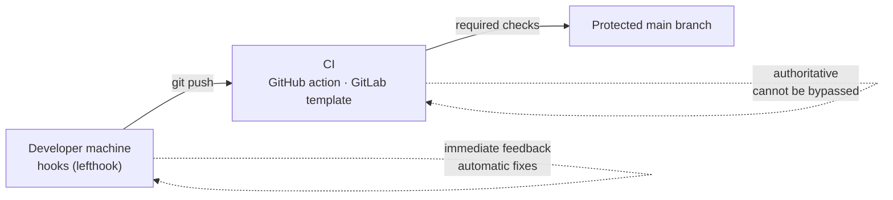

# repogarde

**repogarde** guards the entrance to your Git repositories: commit messages, branch naming, secrets, formatting and tests, **whatever the language**. The same rules apply on developer machines (hooks) and in CI, and `main` is protected on the server side.



| Level | Role | Can be bypassed? |
|---|---|---|
| **Developer machine** | Formats the code, prefixes the commit message, rejects a badly named branch, tests before the push | yes (`--no-verify`) |
| **CI** | Re-runs every check on each PR / MR | no |
| **Server** | Merge blocked if the CI fails, direct push to `main` forbidden | no |

## What repogarde does

<div class="grid cards" markdown>

- **Commit messages** — [Conventional Commits](https://www.conventionalcommits.org) enforced; the prefix is derived from the branch (`feat/cart` → `feat(cart): …`).
- **Branches** — `<type>/<topic>` format, with a suggested rename command; merged branches deleted automatically, on the server and on developer machines.
- **Secrets** — detected by [gitleaks](https://github.com/gitleaks/gitleaks) before the commit and in CI.
- **Formatting** — only the staged content is formatted, with the project's own tool (prettier, ruff, gofmt, Spotless…); work in progress is preserved.
- **Tests** — on push, only the affected projects are tested, on the pushed commit.
- **Dead code** — only *new* dead code is reported: proven (blocking) or candidate (to check); [definition](code-mort.md).
- **Releases** — version computed from the commits, changelog, tag and release, with no token and no manual step; [reusable by your projects](releases.md), with [human approval](validation.md) when needed.

</div>

**More than 25 technologies** detected automatically — Java, JavaScript/TypeScript, Python, Go, Rust, PHP, Ruby, .NET, Flutter, Swift, Elixir, C/C++, Terraform, Helm, Kubernetes, Ansible, Docker… → [the full list](technologies.md).

**In VS Code** — the [repogarde-vscode](https://github.com/SimBienvenueHoulBoumi/repogarde-vscode) extension applies the same rules in the editor: commit assistant, branch name checked in the status bar, alert if the hooks no longer run.

## In 30 seconds

```yaml title="lefthook.yml — project hooks"
remotes:
  - git_url: https://github.com/SimBienvenueHoulBoumi/repogarde
    ref: v3.4.0 # x-release-please-version
    configs: [lefthook-remote.yml]
```

```yaml title=".github/workflows/repogarde.yml — CI (excerpt)"
- uses: actions/checkout@v7
  with: { fetch-depth: 0 }
- uses: SimBienvenueHoulBoumi/repogarde@v3 # x-release-please-major
  with: { strict: true }
```

→ [Quick start](demarrage.md) · [full example: repogarde-demo](https://github.com/SimBienvenueHoulBoumi/repogarde-demo)

## Reliability

- Each language and tool is checked in CI on **a real project** with its own tooling.
- Tested on **Linux, macOS and Windows**; **signed** releases ([verify a release](securite.md)).
- Project assessed by [OpenSSF Scorecard](https://scorecard.dev/viewer/?uri=github.com/SimBienvenueHoulBoumi/repogarde).
