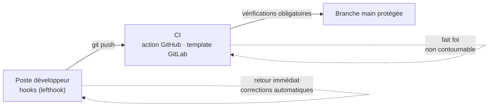

# repogarde

**repogarde** garde l'entrée de vos dépôts Git : messages de commit, nommage des branches, secrets, formatage et tests, **quel que soit le langage**. Les mêmes règles s'appliquent sur les postes (hooks) et en CI, et `main` est protégée côté serveur.



| Niveau | Rôle | Contournable ? |
|---|---|---|
| **Poste** | Formate le code, préfixe le message de commit, refuse une branche mal nommée, teste avant le push | oui (`--no-verify`) |
| **CI** | Refait toutes les vérifications sur chaque PR / MR | non |
| **Serveur** | Merge interdit si la CI échoue, push direct sur `main` interdit | non |

## Ce que fait repogarde

<div class="grid cards" markdown>

- **Messages de commit** — [Conventional Commits](https://www.conventionalcommits.org) imposés ; le préfixe est déduit de la branche (`feat/panier` → `feat(panier): …`).
- **Branches** — format `<type>/<sujet>`, commande de renommage proposée ; branches mergées supprimées automatiquement, sur le serveur et les postes.
- **Secrets** — détection par [gitleaks](https://github.com/gitleaks/gitleaks) avant le commit et en CI.
- **Formatage** — seul le contenu stagé est formaté, avec l'outil du projet (prettier, ruff, gofmt, Spotless…) ; le travail en cours est préservé.
- **Tests** — au push, seuls les projets touchés sont testés, sur le commit poussé.
- **Releases** — version calculée depuis les commits, changelog, tag et archive signée, sans intervention.

</div>

**Plus de 25 technologies** détectées automatiquement — Java, JavaScript/TypeScript, Python, Go, Rust, PHP, Ruby, .NET, Flutter, Swift, Elixir, C/C++, Terraform, Helm, Kubernetes, Ansible, Docker… → [la liste complète](technologies.md).

## En 30 secondes

```yaml title="lefthook.yml — hooks du projet"
remotes:
  - git_url: https://github.com/SimBienvenueHoulBoumi/repogarde
    ref: v1.3.1 # x-release-please-version
    configs: [lefthook-remote.yml]
```

```yaml title=".github/workflows/repogarde.yml — CI (extrait)"
- uses: actions/checkout@v4
  with: { fetch-depth: 0 }
- uses: SimBienvenueHoulBoumi/repogarde@v1 # x-release-please-major
  with: { strict: true }
```

→ [Démarrage rapide](demarrage.md) · [exemple complet : repogarde-demo](https://github.com/SimBienvenueHoulBoumi/repogarde-demo)

## Fiabilité

- Chaque langage et outil est vérifié en CI sur **un vrai projet** avec son outillage.
- Tests sur **Linux, macOS et Windows** ; releases **signées** ([vérifier une release](securite.md)).
- Projet évalué par [OpenSSF Scorecard](https://scorecard.dev/viewer/?uri=github.com/SimBienvenueHoulBoumi/repogarde).
